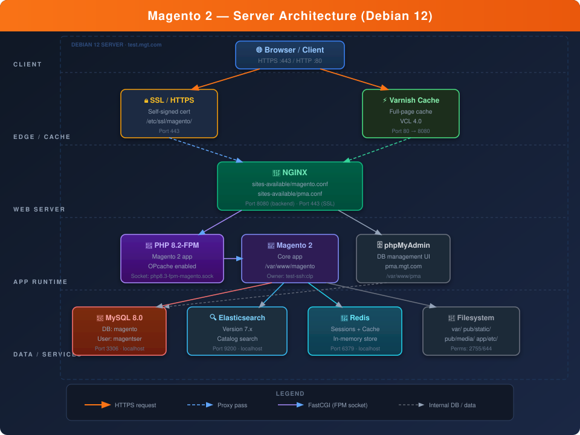
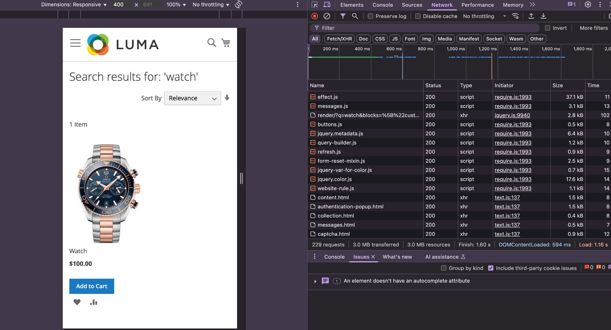
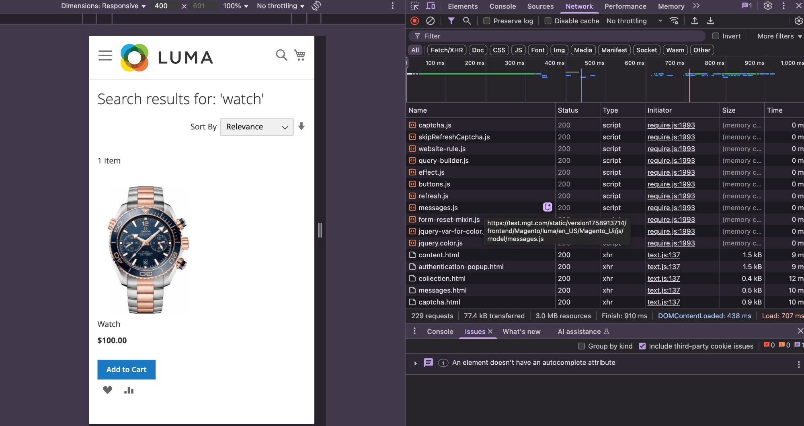
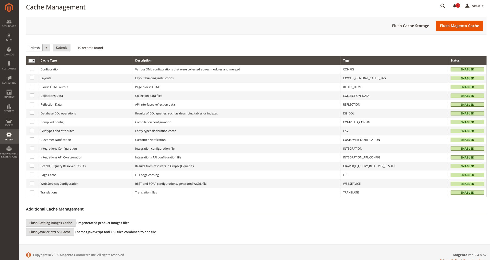
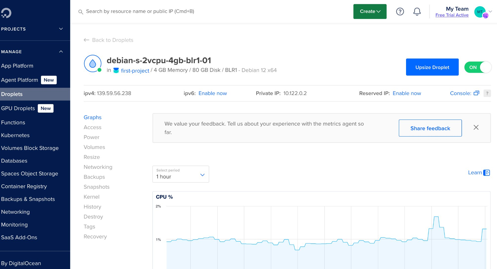

<h1 align="center">🛒 Magento_DeployKit</h1>

<p align="center">
  <b>Automated Magento 2 LEMP bring-up on a single Debian 12 host</b><br>
  <i>An ordered set of Bash scripts that takes a bare 4 GB droplet to a working Magento 2 storefront —<br>
  Varnish, NGINX, PHP-FPM, MySQL 8, Elasticsearch and Redis — plus the error catalogue earned building it.</i>
  <br><br>
  
  
  
  
  
  
  
  
  
</p>

<p align="center">
  
  
  
</p>

> [!IMPORTANT]
> **Read this before you run anything.** This is a **learning and reference artifact**, not a
> production provisioning tool. It is imperative Bash with inline configuration and no convergence
> guarantees — not Ansible, not Terraform, not a container image. The numbered path has **known
> gaps that require two manual steps**; see [Known Limitations](#-known-limitations--roadmap) and
> follow [Quick Start](#-quick-start) exactly. Treat this repo as *executable documentation*.

---

## 📖 Table of Contents

| | |
|---|---|
| [What This Demonstrates](#-what-this-demonstrates) | [Quick Start](#-quick-start) |
| [The Engineering Problem](#-the-engineering-problem) | [What Each Script Does](#-what-each-script-does) |
| [Architecture](#-architecture--design-decisions) | [Configuration & Credentials](#-configuration--credentials) |
| [Stack](#-stack) | [Operations Guide](#-operations-guide) |
| [Performance](#-performance) | [Diagnostics](#-diagnostics) |
| [Screenshots](#-screenshots) | [Troubleshooting](#-troubleshooting) |
| [Repository Structure](#-repository-structure) | [Known Limitations & Roadmap](#-known-limitations--roadmap) |

---

## 🎯 What This Demonstrates

This project goes well beyond "install a CMS." It is an exercise in **infrastructure engineering
under real constraints** — nine interdependent services on one small box, each with its own version
requirements, kernel-level prerequisites and non-obvious failure modes.

- **Ordered, resumable automation** — each stage is a discrete, reviewable script with fail-fast
  guards, not a wall of ad-hoc shell history
- **Multi-layer caching** — Varnish for full-page cache, Redis for object cache and sessions,
  Magento's own internal cache types, each deliberately scoped
- **Separation of concerns at the edge** — Varnish fronts HTTP on `:80`, NGINX terminates TLS on
  `:443`, NGINX serves Varnish's origin on `:8080`, PHP-FPM runs in a dedicated named pool
- **A coherent identity model** — one user/group pair (`test-ssh:clp`) unifies the webroot owner,
  the NGINX worker, the FPM pool and the socket, which is what makes FastCGI permissions work
- **Least-privilege database access** — separate app-level and read-only MySQL users, plus a
  read-only Linux account granted POSIX ACLs rather than loosened `chmod`
- **Kernel and runtime tuning that is actually required** — 2 GB swap, `vm.max_map_count`,
  `LimitNOFILE`, JVM heap sizing, `nproc` limits, `log_bin_trust_function_creators`
- **An operational runbook** — [`docs/Common-errors.md`](docs/Common-errors.md) maps each observed
  symptom to its root cause and verified fix. It is the most reusable asset in this repo.

---

## 🧩 The Engineering Problem

Magento 2 is one of the most infrastructure-demanding open-source platforms in existence. A working
install is not a package — it is a coordinated bring-up of:

- **PHP** at a narrow supported version, with ~15 required extensions
- **Elasticsearch** — Magento 2.4.x removed MySQL catalog search entirely, so search is a hard
  dependency, and ES itself refuses to start without three separate host-level prerequisites
- **Redis**, so sessions survive PHP-FPM process recycling
- **A full-page cache**, without which the platform is unusable under any real load
- **Composer with authenticated access** to Adobe's private package repository
- **MySQL 8** with `log_bin_trust_function_creators` enabled, because the installer creates triggers

Each of these has failure modes that surface *hours later* as a blank white storefront. Done by hand
from the official docs this is a half-day job with a high error rate, and the result is not
reproducible. This repo encodes that bring-up as an ordered script sequence — and, just as
importantly, catalogues every wall hit along the way.

---

## 🏗 Architecture & Design Decisions



```
                     ┌──────────────────────────────────────────────────┐
   HTTP  :80  ──────►│  Varnish 7.x   —  full-page cache, in-memory      │
                     │  default.vcl · PURGE restricted to 127.0.0.1      │
                     └──────────────────┬───────────────────────────────-┘
                                        │  cache miss → 127.0.0.1:8080
                                        ▼
                     ┌──────────────────────────────────────────────────┐
   HTTPS :443 ──────►│  NGINX                                           │◄── ⚠️ bypasses Varnish
   (self-signed)     │  :443 TLS termination · :8080 origin              │    (see Limitations)
                     │  worker user: test-ssh:clp                        │
                     └──────────────────┬───────────────────────────────-┘
                                        │  fastcgi_pass → unix socket
                                        ▼
                     ┌──────────────────────────────────────────────────┐
                     │  PHP-FPM pool [magento]                          │
                     │  test-ssh:clp · pm=dynamic · max_children=20      │
                     └──────────────────┬───────────────────────────────-┘
                                        ▼
                     ┌──────────────────────────────────────────────────┐
                     │  Magento 2.4.7  —  /var/www/magento              │
                     └──┬──────────┬──────────┬──────────────┬──────────┘
                        ▼          ▼          ▼              ▼
                   MySQL :3306  ES :9200  Redis :6379   pub/static · pub/media
                   catalog,     catalog   cache db0,    (local filesystem)
                   orders,      search    sessions db1
                   config
```

### Why this topology?

| Decision | Rationale |
|---|---|
| **Varnish on :80, NGINX origin on :8080** | Varnish cannot terminate TLS. Splitting the ports keeps the cache and the TLS/origin concerns cleanly separated, and lets Varnish be restarted independently of the web tier. |
| **A dedicated PHP-FPM pool, not `www`** | The default pool runs as `www-data`. A named pool running as `test-ssh:clp` — the same identity as the NGINX worker and the webroot owner — means socket permissions align by construction instead of by `chmod`, and process limits are scoped to Magento alone. |
| **One identity across four layers** | NGINX's `user` directive, the FPM pool `user`, the socket's `listen.owner`/`listen.group` and the webroot owner **must all agree**. Breaking that alignment is the single most common failure in the error catalogue: `(13: Permission denied)` on the FastCGI socket. |
| **Elasticsearch over MySQL search** | Magento 2.4+ dropped built-in MySQL catalog search — this is not optional. ES also brings real tokenization, relevance scoring and a path to scale. |
| **Redis for sessions, not files** | File-based PHP sessions do not survive FPM process recycling gracefully. Redis gives atomic writes and process independence — the difference between a recycled worker and a customer losing their cart. |
| **2 GB swap on a 4 GB box** | `composer create-project` and `setup:di:compile` are *memory spikes*, not sustained load. Swap absorbs the spike and prevents OOM kills without paying for a larger droplet permanently. |
| **`setgid` (2755) on directories** | Files created at runtime by PHP-FPM inherit the `clp` group, so NGINX can still read them. Plain `755` re-breaks within a day. |
| **POSIX ACLs for the read-only user** | `setfacl -m u:readonly-user:rX` grants inspection access without loosening the mode bits for everyone else. |

---

## 📦 Stack

| Layer | Component | Version | Port | Notes |
|---|---|---|---|---|
| Edge cache | Varnish Cache | 7.x (Debian repo) | **80** | Systemd unit patched `:6081` → `:80` |
| TLS | NGINX + OpenSSL | Debian repo | **443** | **Self-signed**, 365-day, RSA-2048 |
| Web server | NGINX | Debian repo | **8080** | Varnish origin; runs as `test-ssh:clp` |
| App runtime | PHP-FPM | **8.2 / 8.3** ⚠️ | unix socket | See [Limitation #1](#-known-limitations--roadmap) |
| Application | Magento 2 Open Source | 2.4.7 | — | Luma sample theme |
| Database | MySQL Community Server | 8.0.x (Oracle APT) | 3306 | `log_bin_trust_function_creators=1` |
| Search | Elasticsearch | 7.x | 9200 | 2 GB JVM heap, `vm.max_map_count=262144` |
| Cache / sessions | Redis | Debian repo | 6379 | cache → db0, sessions → db1 |
| DB admin UI | phpMyAdmin | Debian repo | via NGINX | Own vhost, `pma.mgt.com` |
| Dep manager | Composer | 2.x | — | SHA-384 checksum-verified installer |
| Host | DigitalOcean droplet | Debian 12 | — | 2 vCPU / 4 GB / 80 GB, BLR1 |

### Host-level prerequisites the scripts configure

| Setting | Value | Why it is required |
|---|---|---|
| Swap file | 2 GB at `/swapfile`, `fstab`-persisted | Composer + DI compilation OOM on 4 GB without it |
| `vm.max_map_count` | `262144` | Elasticsearch refuses to start below this |
| `LimitNOFILE` | `65536` via systemd drop-in | ES bootstrap check failure otherwise |
| ES JVM heap | `-Xms2g -Xmx2g` | Default heap thrashes on a constrained box |
| `nproc` limits | 4096 soft + hard for `test-ssh` | Magento spawns many short-lived processes |
| `log_bin_trust_function_creators` | `1`, persisted to `mysqld.cnf` | Installer creates triggers; fails without `SUPER` on MySQL 8 |

---

## ⚡ Performance

Varnish full-page cache impact, measured on a catalog search result page:

| | Cold cache (first request) | Warm cache (subsequent) |
|---|---|---|
| **Data transferred** | 3.0 MB | 77.4 kB |
| **Time to finish** | 1.60 s | 910 ms |
| **Delta** | — | **~97 % less data, ~43 % faster** |


*Cold cache — full PHP → MySQL → Elasticsearch round trip: 3.0 MB, 1.60 s*


*Warm cache — served from Varnish memory: 77.4 kB, 910 ms*

> [!NOTE]
> **Measurement caveat, stated honestly.** These figures were captured over **`http://`**, which is
> the only path that traverses Varnish in the current topology. HTTPS traffic on `:443` goes straight
> to PHP-FPM and does **not** benefit from this — see
> [Limitation #3](#-known-limitations--roadmap). These two screenshots are the project's regression
> baseline: reproduce them before and after any caching change.

---

## 🖼 Screenshots

### Storefront


*Default Luma theme, served over HTTPS via NGINX*


*Catalog search powered by Elasticsearch 7 — query `watch` against the product index*

### Admin Panel


*Admin at `https://test.mgt.com/admin` — self-signed certificate*


*All cache types enabled; full-page cache active and backed by Varnish*

### Infrastructure


*phpMyAdmin at `https://pma.mgt.com` — separate vhost, same NGINX/PHP-FPM stack*


*2 vCPU / 4 GB RAM / 80 GB — DigitalOcean BLR1 (Bangalore)*

### Live HTTPS endpoints

| URL | What it serves |
|---|---|
| `https://test.mgt.com` | Magento storefront (Luma) |
| `https://test.mgt.com/admin` | Admin panel |
| `https://test.mgt.com/catalogsearch/result/?q=watch` | Elasticsearch-backed catalog search |
| `https://pma.mgt.com` | phpMyAdmin |

<p align="center">
  
  
  
</p>

---

## 📁 Repository Structure

```
Magento_DeployKit/
├── 01-System-Prep.sh                       # Swap, nproc limits, APT keys, base packages
├── 02-PHP-MySQL-Installation.sh            # PHP 8.2-FPM + extensions, Composer, MySQL 8, DB + users
├── 03-NGINX-Composer-Setup.sh              # NGINX + run-as-user rewrite, Composer auth.json
├── 04-Elasticsearch-Redis-Installation.sh  # Elasticsearch 7.x (heap, sysctl, ulimits) + Redis
├── 05-Magento-Installation.sh              # setup:install, static content deploy, reindex
├── 06-Web-Server-Config.sh                 # PHP-FPM pool, NGINX vhosts, self-signed TLS, Varnish
├── 07-Final-Config-Checks.sh               # Permissions, ACLs, base URLs, FPC → Varnish, health check
│
├── nginx/
│   └── test.mgt.com.conf                   # Hardened reference vhost — see note below
├── docs/
│   ├── Common-errors.md                    # ⭐ The runbook: symptom → root cause → verified fix
│   ├── architecture-diagram.svg
│   └── screenshots/                        # 01–11, proof-of-work evidence
│
├── README.md · LICENSE (MIT) · .gitignore
```

> [!TIP]
> **`nginx/test.mgt.com.conf` is the most correct config in this repo** — and nothing currently
> references it. It is the only vhost that handles Magento's `static/version*/` rewrite (without
> which **every static asset 404s in production mode**), the `/static.php` fallback, a `return 403`
> guard on PHP execution under `/static/`, and enlarged `fastcgi_buffers` (the documented fix for
> the "upstream sent too big header" 502 on admin login). Adopting it in `06` is
> [roadmap item P2-12](#p2--architectural-correctness).

---

## 🚀 Quick Start

### Prerequisites

- Fresh **Debian 12 (bookworm)** host — **2 vCPU / 4 GB RAM / 40 GB disk minimum**.
  Below 4 GB, Elasticsearch + MySQL + PHP will thrash even with swap.
- Root or passwordless-`sudo` shell.
- An **Adobe Commerce Marketplace** account with generated access keys
  (*Marketplace → My Profile → Access Keys*). The **public key is the Composer username**, the
  **private key is the password**.
- DNS or `/etc/hosts` entries for `test.mgt.com` and `pma.mgt.com` on **both** the server and your
  workstation.

### 1 · Clone

```bash
git clone https://github.com/Asit0007/Magento_DeployKit.git
cd Magento_DeployKit
chmod +x *.sh
```

### 2 · Export Marketplace credentials

Scripts hard-exit if these are unset — deliberately, since a Composer failure 20 minutes into a run
is far more expensive than failing at second zero.

```bash
export MAGENTO_COMPOSER_PUBLIC="<your_public_key>"
export MAGENTO_COMPOSER_PRIVATE="<your_private_key>"
```

### 3 · Set your own values in each script's variable block

Each script carries its own variable block near the top. **Generate real secrets — do not ship the
placeholder values.**

```bash
# Generate strong values first:
openssl rand -base64 24
```

```bash
MAGENTO_DOMAIN="test.mgt.com"
PMA_DOMAIN="pma.mgt.com"
WEB_USER="test-ssh"
WEB_GROUP="clp"
MYSQL_ROOT_PASS="<generate-your-own>"
MAGENTO_DB_PASS="<generate-your-own>"
MYSQL_READONLY_PASS="<generate-your-own>"
ADMIN_EMAIL="<your@email.com>"
ADMIN_PASS="<generate-your-own>"
```

> Because these blocks are **copy-pasted into all seven scripts**, a value changed in one and not the
> others produces an authentication failure that is genuinely hard to trace. Change them everywhere,
> or implement [roadmap item P1-6](#p1--makes-the-documented-path-actually-work).

### 4 · Run the system, runtime and service stages

```bash
sudo -E ./01-System-Prep.sh
sudo -E ./02-PHP-MySQL-Installation.sh
sudo -E ./03-NGINX-Composer-Setup.sh
sudo -E ./04-Elasticsearch-Redis-Installation.sh
```

`-E` preserves the exported Composer keys through the `sudo` privilege boundary.

### 5 · Manual step — create the service identity and download Magento

> [!WARNING]
> **No numbered script creates the `test-ssh` user or downloads Magento itself.** This is
> [Limitation #2](#-known-limitations--roadmap). Without this step `05` fails immediately, because
> it invokes a `bin/magento` binary that does not exist yet. Run this between `04` and `05`:

```bash
# Service identity — the load-bearing user/group pair
sudo groupadd -f clp
id -u test-ssh || sudo useradd -m -s /bin/bash -g clp test-ssh

# Fetch Magento from Adobe's authenticated repository
sudo -u test-ssh composer --working-dir=/tmp create-project \
  --repository-url=https://repo.magento.com/ \
  magento/project-community-edition=2.4.7 magento-src

# Stage it into the webroot
sudo mkdir -p /var/www/magento
sudo rsync -a /tmp/magento-src/ /var/www/magento/
sudo chown -R test-ssh:clp /var/www/magento
```

Expect this to take 10–20 minutes and to be the point where the 2 GB swap earns its keep.

### 6 · Run the application and web-server stages

> [!CAUTION]
> Before running these two, apply the fixes for
> [Limitation #1 (PHP 8.2/8.3)](#-known-limitations--roadmap) and
> [Limitation #4 (Elasticsearch version)](#-known-limitations--roadmap), or they will fail.

```bash
sudo -E ./05-Magento-Installation.sh
sudo -E ./06-Web-Server-Config.sh
sudo -E ./07-Final-Config-Checks.sh
```

### 7 · Point your workstation at the host

```bash
echo "<DROPLET_IP> test.mgt.com pma.mgt.com" | sudo tee -a /etc/hosts
sudo passwd readonly-user     # on the server: give the shareable read-only account a password
```

Then browse to **`https://test.mgt.com`** and accept the self-signed certificate warning.

---

## 🔍 What Each Script Does

### `01-System-Prep.sh` — System preparation
Creates a 2 GB swap file and persists it to `/etc/fstab`. Raises `nproc` limits to 4096 (soft and
hard) for the web user. Imports GPG keys and registers the APT repositories for MySQL and
Elasticsearch 7.x — **with an empty-keyring check** (`[ ! -s keyring ] && error_exit`) that catches
the silent `curl | gpg` pipeline failure that otherwise produces a 0-byte key and a baffling APT
error much later. Installs base utilities (`curl`, `git`, `unzip`, `rsync`, `jq`, `gnupg2`, …).

### `02-PHP-MySQL-Installation.sh` — Runtime and database
Installs PHP 8.2-FPM plus every Magento-required extension (`intl`, `soap`, `gd`, `bcmath`, `gmp`,
`mbstring`, `xml`, `zip`, `opcache`, …). Installs Composer 2 with **SHA-384 checksum verification**
of the installer before execution. Installs MySQL 8.0 from Oracle's repo, creates the `magento`
schema, the application DB user, and a `SELECT`-only read-only DB user.

### `03-NGINX-Composer-Setup.sh` — Web server and Composer auth
Installs NGINX and **rewrites the global `user` directive** in `/etc/nginx/nginx.conf` to
`test-ssh clp` — the change that makes the whole FastCGI socket permission model work. Validates
that the Marketplace keys are exported and hard-exits if not. Writes
`/home/test-ssh/.composer/auth.json` at mode `0600`, owned by the web user.

### `04-Elasticsearch-Redis-Installation.sh` — Search and cache
Installs Elasticsearch 7.x and applies the three prerequisites it silently needs: JVM heap pinned to
`-Xms2g -Xmx2g`, `vm.max_map_count=262144` via `sysctl` and persisted, and `LimitNOFILE=65536` via a
proper systemd drop-in. Each of these produces a *different* opaque startup failure when missing —
this was the hardest part of the build. Then installs Redis and waits for `redis-cli ping`.

### `05-Magento-Installation.sh` — Magento core install
Runs `bin/magento setup:install` with full database, search, URL-rewrite and admin configuration,
then deploys static content and reindexes every indexer.

### `06-Web-Server-Config.sh` — Server configuration
Writes a dedicated PHP-FPM pool for the web user with a named socket
(`/run/php/php8.3-fpm-magento.sock`, `pm=dynamic`, `max_children=20`). Writes NGINX vhosts for
Magento (`:8080` origin and `:443` TLS) and for phpMyAdmin. Generates a self-signed 365-day RSA-2048
certificate. Installs Varnish, writes a minimal `default.vcl` with an IP-restricted PURGE handler,
and moves Varnish's listener from `:6081` to `:80`.

### `07-Final-Config-Checks.sh` — Permissions, config and health check
Sets final ownership and modes (`2755` directories with the setgid bit, `644` files). Creates the
`readonly-user` Linux account and grants it `rX` on the webroot via **POSIX ACLs**. Persists
`log_bin_trust_function_creators=1` into `mysqld.cnf` so it survives reboot. Sets both base URLs and
switches Magento's full-page cache application to Varnish. Prints a health summary across all
services.

---

## 🔐 Configuration & Credentials

> [!CAUTION]
> **Every value below is a placeholder.** Generate your own with `openssl rand -base64 24` before
> running anything, and never commit real values. Earlier revisions of this repository contained
> live credentials in tracked files; anything that has reached a public remote must be treated as
> permanently disclosed and rotated at the source, not merely deleted.

| Principal | Kind | Purpose | Value |
|---|---|---|---|
| `test-ssh` : `clp` | Linux user : group | Owns webroot, runs NGINX **and** PHP-FPM, runs all `bin/magento` | — |
| `readonly-user` | Linux user | Shareable shell account, `rX` on webroot via ACL, no sudo | set with `passwd` |
| `root` @ MySQL | DB user | Schema creation, `SET GLOBAL`, administration | `<generate-your-own>` |
| `magentser` @ localhost | DB user | Magento application user, `ALL` on the `magento` schema | `<generate-your-own>` |
| `readonly_db_user` @ `%` | DB user | Shareable, `SELECT`-only ⚠️ note the host wildcard | `<generate-your-own>` |
| `admin` @ Magento | App user | Admin panel login | `<generate-your-own>` |

### Environment variables

| Variable | Required | Consumed by | Purpose |
|---|---|---|---|
| `MAGENTO_COMPOSER_PUBLIC` | ✅ | `03` | Marketplace public key → Composer username for `repo.magento.com` |
| `MAGENTO_COMPOSER_PRIVATE` | ✅ | `03` | Marketplace private key → Composer password |

Everything else is edited inline in each script's variable block. Nothing is read from a `.env`.

> `sudo -E` preserves the **entire** environment across the privilege boundary, not just these two
> variables. The tighter form is
> `sudo MAGENTO_COMPOSER_PUBLIC=… MAGENTO_COMPOSER_PRIVATE=… bash ./03-NGINX-Composer-Setup.sh`.

---

## 🛠 Operations Guide

**Always run `bin/magento` as `test-ssh`.** Running it as `root` corrupts file ownership and is the
single most common self-inflicted outage on this stack.

```bash
cd /var/www/magento
M="sudo -u test-ssh php bin/magento"

# Cache
$M cache:flush                    # flush everything, including Varnish/Redis backends
$M cache:clean                    # invalidate only
$M cache:status

# Indexing
$M indexer:reindex
$M indexer:status

# Deploy lifecycle
$M setup:upgrade                  # after any module or version change
$M setup:di:compile               # required for production mode
$M setup:static-content:deploy -f
$M maintenance:enable  /  $M maintenance:disable

# Inspection
$M module:status
$M config:show web/secure/base_url

# Dev environments only — 2FA with no mail transport locks you out of your own admin
$M module:disable Magento_TwoFactorAuth Magento_AdminAdobeImsTwoFactorAuth
```

### Cache-layer operations

```bash
# ── Varnish ────────────────────────────────────────────────
sudo varnishstat                        # live hit/miss counters; watch nuked_objects for eviction
sudo varnishlog -g request              # per-request trace
curl -X PURGE http://127.0.0.1/         # PURGE is 127.0.0.1-only by VCL
sudo systemctl reload varnish

# ── Redis ──────────────────────────────────────────────────
redis-cli ping
redis-cli -n 0 dbsize                   # object cache
redis-cli -n 1 dbsize                   # sessions
redis-cli -n 0 FLUSHDB                  # cache only — never FLUSHALL, it destroys sessions

# ── Elasticsearch ──────────────────────────────────────────
curl -s localhost:9200/_cat/health?v
curl -s localhost:9200/_cat/indices?v | grep magento
```

### The permission reset (you will need this)

```bash
cd /var/www/magento
sudo chown -R test-ssh:clp .
sudo find . -type d -exec chmod 2755 {} \;     # 2755 = setgid — the load-bearing part
sudo find . -type f -exec chmod 644  {} \;
sudo chmod -R g+w var pub/static pub/media app/etc generated
```

The **setgid bit is what matters**: it makes files created by PHP-FPM inherit the `clp` group, which
keeps NGINX able to read them. Plain `755` re-breaks within a day.

---

## 🩺 Diagnostics

```bash
# Service status  (php8.3-fpm on hosts built via 06 — see Limitation #1)
sudo systemctl status nginx php8.3-fpm mysql elasticsearch redis-server varnish
sudo journalctl -f -u nginx -u php8.3-fpm -u mysql -u elasticsearch -u varnish

# Magento application logs
sudo tail -f /var/www/magento/var/log/system.log
sudo tail -f /var/www/magento/var/log/exception.log

# NGINX
sudo tail -f /var/log/nginx/error.log
sudo tail -f /var/log/nginx/test.mgt.com.error.log
sudo nginx -t                                    # validate config before reloading

# Backing services
curl -s http://localhost:9200/_cat/health?v      # Elasticsearch
redis-cli ping                                   # Redis
mysqladmin -u root -p status                     # MySQL
```

### Quick reference card

```
Webroot          /var/www/magento                       Owner  test-ssh:clp
PHP-FPM pool     /etc/php/8.3/fpm/pool.d/test-ssh.conf
FPM socket       /run/php/php8.3-fpm-magento.sock
NGINX vhosts     /etc/nginx/sites-available/{magento,magento-ssl,pma,pma-ssl}.conf
TLS material     /etc/ssl/magento/self.{crt,key}
Varnish VCL      /etc/varnish/default.vcl               Listens :80 → nginx :8080
Magento env      /var/www/magento/app/etc/env.php       ← DB password + crypt key live here
Magento logs     /var/www/magento/var/log/{system,exception,debug}.log
MySQL config     /etc/mysql/mysql.conf.d/mysqld.cnf
ES config        /etc/elasticsearch/{elasticsearch.yml,jvm.options}
ES override      /etc/systemd/system/elasticsearch.service.d/override.conf
Composer auth    /home/test-ssh/.composer/auth.json     (0600)

Ports   80 Varnish · 443 NGINX-TLS · 8080 NGINX-origin (⚠️ world-open, see Limitation #5)
        3306 MySQL · 9200 Elasticsearch · 6379 Redis    (loopback by default)
```

---

## 🧯 Troubleshooting

**📕 Full runbook: [`docs/Common-errors.md`](docs/Common-errors.md)** — symptom → root cause →
verified fix, written from errors actually hit during this build.

| Symptom | Root cause | Fix |
|---|---|---|
| 403 / 404 on all CSS, JS, images | Static content not deployed, or `static/version*/` rewrite missing from the vhost | `setup:static-content:deploy -f`, then add the `rewrite ^/static/version\d*/(.*)$` rule |
| **502 Bad Gateway** on admin login | FastCGI response header exceeds the buffer | `fastcgi_buffers 16 16k; fastcgi_buffer_size 32k;` |
| `(13: Permission denied)` on the socket | NGINX worker user ≠ FPM `listen.owner`/`listen.group` | Align all four identities on `test-ssh:clp` |
| `generated/` permission errors | Ownership drift after a `root`-run CLI command | Run the [permission reset](#the-permission-reset-you-will-need-this) |
| Redis session or cache errors | Wrong DB index or connection config | Verify the Redis block in `app/etc/env.php` |
| Elasticsearch indexing fails | ES not ready, or a version/engine mismatch | `curl localhost:9200/_cat/health?v`; check the configured engine |
| ES will not start at all | `vm.max_map_count`, JVM heap, or `LimitNOFILE` | All three are set by `04` — verify they survived a reboot |
| 2FA blocks admin login | 2FA module active with no mail transport configured | Disable `Magento_TwoFactorAuth` on dev boxes |
| Products not visible on the storefront | Index stale, or website/store-view assignment missing | `indexer:reindex` + check product website assignment |
| `no commands defined in the "indexer" namespace` | The install did not actually complete | Re-run `setup:install`; check `var/log/` for the real failure |

---

## 🚧 Known Limitations & Roadmap

This section is deliberate. The repository is published as a reference, and a reference that hides
its gaps is worse than useless. Everything below is verified against the tracked scripts.

### Known limitations

| # | Limitation | Impact | Where |
|:-:|---|---|---|
| **1** | **PHP version split.** `02` installs **8.2**; `06` writes its pool to `/etc/php/8.3/…`, uses `php8.3-fpm-magento.sock` and restarts `php8.3-fpm`. `nginx/test.mgt.com.conf` also targets 8.3. | `06` fails at `tee /etc/php/8.3/…` (no such directory) or at `systemctl restart php8.3-fpm` (no such unit). **Pick one version and change it in all four places** — 8.3 is the better choice; Magento 2.4.7 supports it. | `02:52`, `06:53,57,67,69` |
| **2** | **The numbered path does not create the service user or download Magento.** Both steps exist only outside the tracked scripts. | `05` calls a `bin/magento` that does not exist. Mitigated by the [manual step](#5--manual-step--create-the-service-identity-and-download-magento) in Quick Start; the real fix is a `04.5-Magento-Download.sh`. | `01`–`07` |
| **3** | **Varnish is bypassed for HTTPS traffic.** `07` sets both `web/secure/base_url` and `web/unsecure/base_url` to `https://`, and the `:443` vhost goes straight to PHP-FPM. Meanwhile `caching_application 2` tells Magento that Varnish owns the FPC, so it stops populating its own. | Production-shaped traffic gets **no full-page cache at all**. Fix: terminate TLS *in front of* Varnish (NGINX `:443` → Varnish `:80` → NGINX origin `:8080`, with `X-Forwarded-Proto` set in VCL), or move TLS to a load balancer. | `07:82-84`, `06:151-173` |
| **4** | **Search-engine version mismatch.** `01` registers the Elastic **7.x** repo, but `05` passes `--search-engine=elasticsearch8`. | Magento validates the engine handshake at install time; this combination fails. Use `elasticsearch7` — or migrate to **OpenSearch 2.x**, which Adobe now treats as the default (ES 7.17 is EOL). | `01:84`, `05:63` |
| **5** | **The VCL is a stub.** `default.vcl` has a backend and a PURGE ACL and nothing else — no `X-Magento-Tags-Pattern` ban handling, no grace mode, no health probes, no static/admin bypass. | **Product and CMS edits never invalidate the cache** — stale content until a manual flush. Fix: `bin/magento varnish:vcl:generate --export-version=7 > /etc/varnish/magento.vcl`. | `06:188-192` |
| **6** | **Not idempotent, despite the claim in `03`.** `05` runs `--cleanup-database` (drops every table). `04` appends a duplicate `vm.max_map_count` line to `/etc/sysctl.conf` on every run. `06` regenerates the TLS certificate (new fingerprint) and patches the **package-owned** `varnish.service` in place — silently reverted by the next `apt upgrade`. `apt install phpmyadmin` opens an interactive `dbconfig-common` dialog that hangs unattended runs. | Re-running is destructive, not convergent. Use `systemctl edit varnish` drop-ins and `DEBIAN_FRONTEND=noninteractive`. | `04:60`, `05:62`, `06:145,198` |
| **7** | **`wait_for_service` never times out.** The timeout branch prints a dot and keeps looping instead of calling `error_exit`. `01:38` compounds this with a `$(date +s)` typo (missing `%`), which makes the elapsed calculation permanently negative. | A failed Elasticsearch start — common on 4 GB — hangs the run **forever**, looking like a slow install. | all six scripts; `01:38` |
| **8** | **`05` sets `chmod 777` / `666`** on `var`, `pub/static`, `pub/media` and **`app/etc`**. `app/etc/env.php` holds the DB password and crypt key; `666` makes it world-readable *and* world-writable. | `07` later tightens this correctly, but the box is world-writable in between — and permanently so if you stop after `05`. **Delete those two lines.** | `05:81-82` |
| **9** | **No firewall, and `:8080` is world-open.** Nothing configures `ufw`, `nftables` or a cloud firewall. Port 8080 is the *unencrypted* Varnish origin — anyone can bypass both TLS and Varnish. There is also no `default_server` vhost, so an unknown `Host` header falls through to whichever block loaded first (possibly phpMyAdmin). | Bind the origin with `listen 127.0.0.1:8080;` and add a catch-all `default_server` returning `444`. phpMyAdmin should sit behind an IP allowlist or an SSH tunnel. | `06` |
| **10** | **Configuration is duplicated across all seven scripts** rather than sourced from one file, and the copies have already drifted. | A value changed in one script and not another yields an authentication failure that is hard to attribute. | `01`–`07` |
| **11** | **Operational gaps for anything beyond dev.** No `cron:install` (so scheduled reindexing, order emails and cache flushing never run), no `deploy:mode:set production`, no `setup:di:compile` in either automated path, no SMTP, no backup/restore, no monitoring. | Fine for a dev box; a slow-motion outage on a real store. | — |

### Scaling ceiling

This design stops hard at one node. `pm.max_children = 20` × ~256 MB per Magento PHP process is
roughly 5 GB on a **4 GB** box; Elasticsearch wants 2 GB of heap and MySQL's buffer pool wants
another 1–2 GB. **8 GB is the realistic floor** for this topology on a single host. The webroot,
`pub/media` and `generated/` are all local filesystem, so horizontal scale needs shared object
storage and a build-and-ship deploy. `innodb_buffer_pool_size` is never tuned off its 128 MB
default, and Varnish runs on the default 256 MB malloc store.

### Roadmap

#### P0 — correctness blockers
- [ ] Unify on PHP **8.3** across `02`, `06` and `nginx/test.mgt.com.conf`
- [ ] Change `--search-engine=elasticsearch8` → `elasticsearch7` (or migrate to OpenSearch 2.x)
- [ ] Delete the `chmod 777` / `666` lines from `05`

#### P1 — makes the documented path actually work
- [ ] Add `04.5-Magento-Download.sh` (service-user creation + `composer create-project` + webroot staging)
- [ ] Source a single `00-vars.sh` from every script; delete the six inline blocks
- [ ] Make `wait_for_service` genuinely time out, and fix the `$(date +s)` typo in `01`
- [ ] Bind `:8080` to loopback; add a `default_server` vhost returning `444`

#### P2 — architectural correctness
- [ ] Put Varnish in the HTTPS path (NGINX `:443` → Varnish `:80` → origin `:8080`), or move TLS to a load balancer
- [ ] Generate and install the real Magento VCL (`varnish:vcl:generate`)
- [ ] Adopt `nginx/test.mgt.com.conf` (or Adobe's `nginx.conf.sample`) in `06`
- [ ] Add `cron:install`, `deploy:mode:set production` and `setup:di:compile`
- [ ] Convert in-place systemd edits to proper drop-in overrides

#### P3 — engineering maturity
- [ ] `shellcheck` + `gitleaks` in a GitHub Actions workflow
- [ ] Replace the self-signed certificate with Let's Encrypt via Certbot
- [ ] Preflight checks (RAM, disk, DNS, architecture) and a `--dry-run` flag
- [ ] Port to Ansible — this workload is exactly what a playbook is for, and it buys real idempotency
- [ ] Backup and restore automation
- [ ] Secrets management (HashiCorp Vault or Ansible Vault) instead of inline variables

---

## 💡 What I Learned

- **Varnish and TLS cannot share a port, and that constraint shapes the whole topology.** Varnish
  has no TLS support, so the design has to split: NGINX terminates on `:443`, Varnish fronts `:80`,
  NGINX serves the origin on `:8080`. Getting the port map right meant tracing the full request path
  before writing a single config line — and, later, discovering that my own base-URL configuration
  routed all real traffic *around* the cache I had just built (Limitation #3). Building a cache is
  easy; proving traffic actually traverses it is the real work.

- **FastCGI socket permissions are an identity problem, not a `chmod` problem.** A generic `www`
  pool running under a different UID than the NGINX worker produces silent 502s. The fix is not
  loosening modes — it is recognising that four things (NGINX `user`, FPM pool `user`, socket
  `listen.owner`/`listen.group`, webroot owner) form a single invariant that must hold.

- **The setgid bit is the difference between a fix and a fix that lasts.** `chmod 755` on Magento's
  directories works until PHP-FPM creates the next file. `2755` makes new files inherit the group,
  so NGINX can still read them tomorrow.

- **Elasticsearch fails in three different ways for three different reasons.** JVM heap,
  `vm.max_map_count` and `LimitNOFILE` each produce a distinct opaque startup error, and none of
  them appear in Magento's install documentation. This was the single hardest part of the build.

- **Swap is a spike absorber, not a RAM substitute.** Composer's dependency resolution and
  `setup:di:compile` spike memory briefly rather than sustaining it, so 2 GB of swap prevents OOM
  kills on a 4 GB host without upsizing the droplet — but once the ES *heap* starts swapping, GC
  pauses make search unusable. Knowing which side of that line you are on matters.

- **`.gitignore` does nothing to a file that is already tracked.** `git rm --cached` is the actual
  fix. Learning this the hard way — after committing `.DS_Store` and configuration files — made the
  distinction between the index and the working tree concrete rather than theoretical, and taught a
  more expensive lesson besides: **anything that reaches a public remote is permanently disclosed.**
  Rewriting history does not un-publish a secret; only rotating it at the source does.

- **A runbook written during the incident is worth more than documentation written after.**
  [`docs/Common-errors.md`](docs/Common-errors.md) is the most reused artifact in this repo, and
  every entry in it cost real debugging time.

---

## 🔒 Security

All credentials referenced in this repository are **placeholders** and must be replaced before any
deployment. Sensitive values — database passwords, admin credentials, Marketplace keys — belong in
environment variables or a secrets manager, never in tracked files.

If you are adapting this kit, address these before exposing the host to a network:

- Bind `:8080` to loopback and add a catch-all `default_server` returning `444`
- Scope `readonly_db_user` to `localhost` or a specific CIDR rather than the `%` wildcard
- Put phpMyAdmin behind an IP allowlist or an SSH tunnel, or do not install it
- Replace the self-signed certificate with a CA-signed one (`certbot --nginx`)
- Randomise `backend-frontname` — it is currently the predictable literal `admin`
- Use `mysql --defaults-extra-file=` instead of passing passwords on the command line, where they
  are visible in `ps` to every local user
- Add a pre-commit secret scanner (`gitleaks`, `detect-secrets`)

Found a vulnerability or a hardening gap? Open an issue or email
[asitminz007@gmail.com](mailto:asitminz007@gmail.com).

---

## 📄 License

MIT — see [LICENSE](LICENSE).
Built for learning and portfolio purposes. Review, fix the [known limitations](#-known-limitations--roadmap),
and harden before any production use.

---

<p align="center">
  <b>Magento_DeployKit &copy; 2026 · Built by <a href="https://github.com/Asit0007">Asit Minz</a></b><br>
  <i>Built and validated on DigitalOcean Debian 12 (2 vCPU / 4 GB / 80 GB, BLR1)</i>
</p>
